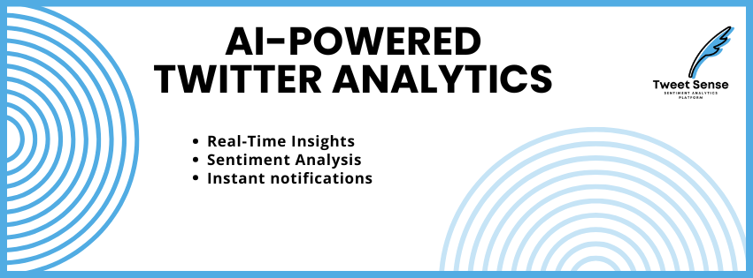

# TweetSense

An **AI-powered sentiment analytics platform** for real-time Twitter data.  
Monitor trending topics, gauge user sentiment, and visualize insights with an intuitive dashboard—all in one place.

---

## Overview

TweetSense is a lightweight platform that streams tweets related to specific keywords, analyzes their sentiment using AI, and presents the results on a live dashboard. This makes it easy for marketers, researchers, and enthusiasts to track public opinion in near real-time.

**Key Objectives:**

1. **Real-Time Insights**: Fetch and process tweets automatically with minimal setup.  
2. **Sentiment Analysis**: Use NLP models to classify tweets into positive, neutral, or negative sentiments.  
3. **Interactive Dashboard**: Explore live metrics, charts, and data tables via a user-friendly interface.

---

## Features

- **Live Data Streaming** – Continuously pulls tweets from Twitter based on your chosen keywords.  
- **Sentiment Classification** – Leverages AI/ML (TextBlob by default) to determine the polarity of each tweet.  
- **Configurable Search** – Easily set your own search terms and filters in the config file or via environment variables.  
- **Responsive Dashboard** – Built with [Streamlit](https://streamlit.io/) to display results in real time.  
- **Scalable Architecture** – Modular code structure allows you to swap in advanced NLP models or integrate databases.  

---

## Tech Stack

| Component             | Technology                                                 | Description                                             |
|-----------------------|------------------------------------------------------------|---------------------------------------------------------|
| **Backend**           | [Python 3.8+](https://www.python.org/)                    | Core language for fetching and processing tweets.       |
| **Twitter API**       | [Tweepy](https://www.tweepy.org/)                         | Python library to connect to the Twitter API.           |
| **Sentiment Analysis**| [TextBlob](https://textblob.readthedocs.io/)  (Optional: [Hugging Face Transformers](https://github.com/huggingface/transformers)) | NLP to classify sentiment of tweet content.             |
| **Dashboard**         | [Streamlit](https://streamlit.io/)                       | Rapid, interactive data app framework.                  |

---

## Architecture

The TweetSense platform follows a simple but flexible architecture:

1. **Data Ingestion**  
   - Uses the Twitter API to fetch tweets in real time (or periodically via search).  
   - Keywords and filters can be set in a config file or via environment variables.
   
2. **Processing & Sentiment Analysis**  
   - Each tweet’s text is fed into an AI/ML model (TextBlob or other) to generate a sentiment score.  
   - The resulting sentiment label (positive, neutral, negative) is appended to the tweet data.

3. **Dashboard & Visualization**  
   - Processed tweets are sent to a Streamlit dashboard or Telegram.  
   - Users can view real-time charts, statistics, and the raw tweet content.

*(You can also expand this by adding a database layer for historical analysis, or a message queue for high throughput.)*

---
### By default, the app will open in your web browser at [http://localhost:8501](http://localhost:8501).

---

### Explore the Dashboard
- View a live table of fetched tweets and their sentiment labels.  
- Check distribution charts showing sentiment breakdown (positive, neutral, negative).  
- See average sentiment scores or top trending keywords (if configured).

---

### Customize
- Update `tweetsense/config.py` or environment variables to change **search keywords**, **language**, or **max tweet count**.  
- Swap out **TextBlob** in `sentiment_analysis.py` for another ML library if you need more advanced NLP.

---

### Example Screenshots
*(Add or replace with your own images.)*

- **Dashboard Overview**  
- **Sentiment Bar Chart**

---

### Roadmap

- **Advanced NLP Integration**  
  Explore [Hugging Face Transformers](https://github.com/huggingface/transformers) or other neural network models for improved sentiment accuracy.

- **Extended Data Storage**  
  Add a database (e.g., PostgreSQL, MongoDB) to store historical tweets for long-term analysis.

- **Analytics & Alerting**  
  Develop a rules engine to trigger alerts when sentiment drastically changes or certain patterns emerge.

- **Multilingual Support**  
  Provide sentiment analysis for non-English tweets via language detection and model selection.

---

### Contributing
Contributions are welcomed! To get started:

1. **Fork** the repository.  
2. **Create a new branch** for your feature or fix.  
3. **Push** your changes to your fork.  
4. **Open a pull request** on this repository with a detailed description of your changes.

Please follow our coding style and ensure your code passes all existing tests.

---

### License
TweetSense is licensed under the [MIT License](./LICENSE). You are free to use, modify, and distribute this software as long as the original license is included.

---

### Community & Support
- **Issues**: Have a bug or a feature request? [Open an issue](https://github.com/YourUsername/TweetSense/issues).  
- **Contact**: For inquiries or collaborations, reach out via [GitHub Discussions](https://github.com/YourUsername/TweetSense/discussions) or email `YourEmail@domain.com`.

We’re excited to have you on board and look forward to improving TweetSense with your feedback and contributions!

---

> **Disclaimer**: TweetSense relies on the Twitter API for data. Always abide by Twitter's Developer Policy and respect user privacy when handling tweet data.
